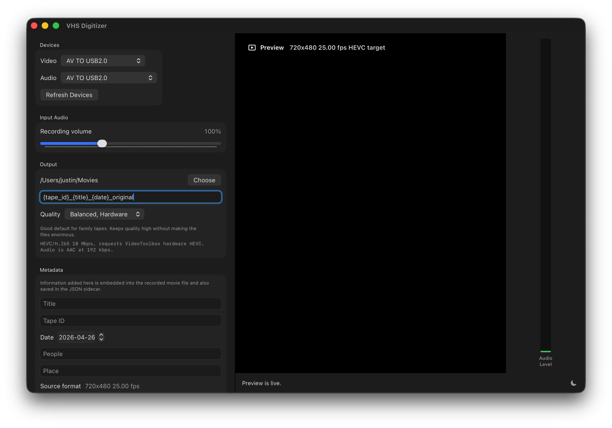

# VHS Digitizer

A native macOS app for previewing and recording analog VHS input from a USB capture device.

VHS Digitizer is designed around common UVC-compatible USB capture cards that expose composite or S-Video input to macOS as a video capture device. It records locally using Apple frameworks and does not require FFmpeg or external command-line tools.

## Features

- Live preview from a selected macOS video capture device.
- Video and audio device selection.
- Recording gain control from 0-300%.
- HEVC/H.265 recording to `.mov`.
- Hardware and software HEVC quality presets.
- Metadata fields for title, tape ID, date, people, place, notes, and source format.
- Embedded movie metadata plus JSON sidecar output.
- Dynamic source format display from the incoming signal.
- Two-channel audio meters with clipping indication.
- Light/dark appearance toggle.
- Native macOS About panel with author and website information.

## Screenshots



## Requirements

- macOS 13 or newer.
- A UVC-compatible USB video capture device.
- A VCR, camcorder, or other analog video source.
- Camera/capture-device and microphone/audio-device permission in macOS.

## Build

```sh
chmod +x build_app.sh
./build_app.sh
```

The script creates:

```text
.build/VHS Digitizer.app
```

Open that `.app` to get proper camera and microphone permission prompts.

## Hardware Notes

VHS capture quality depends heavily on the source hardware. Dropped frames, rolling video, unstable color, or audio drift can be caused by the VCR, tape condition, capture card, or analog signal timing.

For best results:

- Use S-Video instead of composite if your VCR and capture card support it.
- Clean the VCR heads if playback is noisy or unstable.
- Test with a short recording before digitizing a full tape.
- Keep the original `.mov` file and JSON sidecar together.

## Privacy

VHS Digitizer processes video and audio locally on your Mac. It does not include analytics, telemetry, advertising, or upload behavior. See [PRIVACY.md](PRIVACY.md).

## License

MIT. See [LICENSE](LICENSE).
